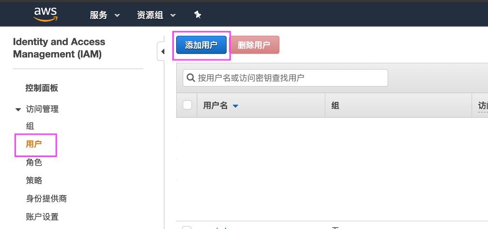
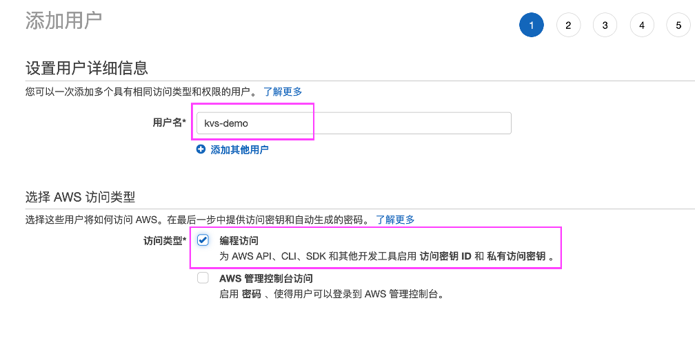
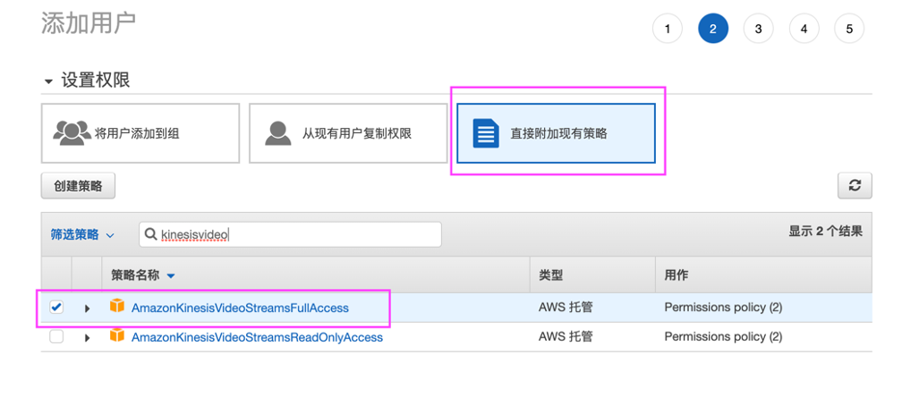
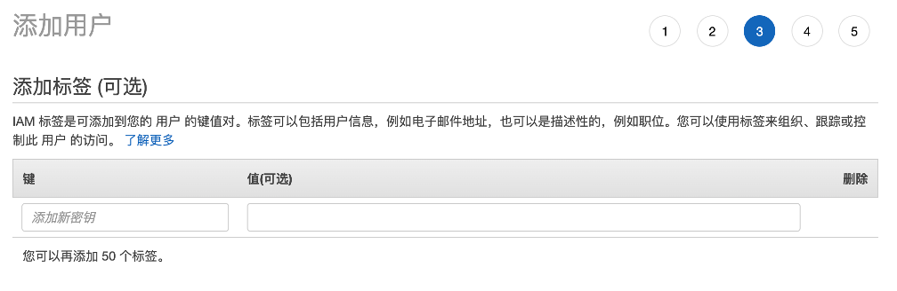
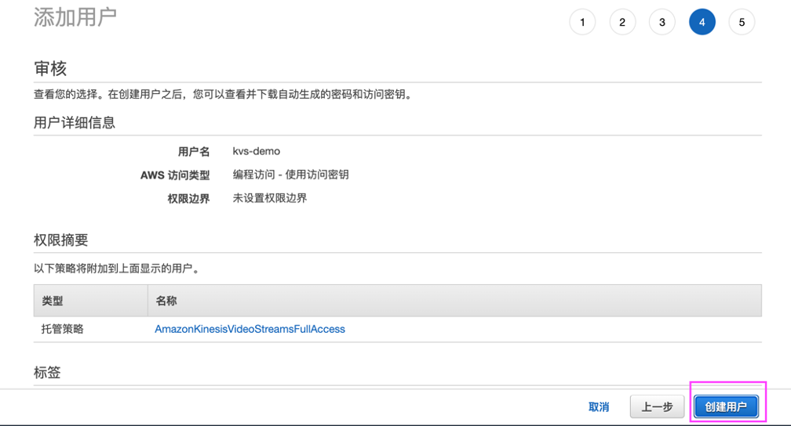
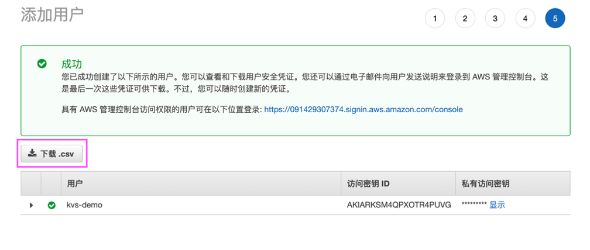

## Lab0:创建新用户

登录AWS Account的账号，在服务界面输入IAM并点击进入。

在左侧展开访问管理，选择“用户”， 然后点击“添加用户”

输入用户名：kvs-demo, 勾选“编程访问”

这里选择“直接附加现有策略”，搜索策略名称“kinesisvideo”勾选“AdminKinesisVideoStreamsFullAccess”这个策略。

不做处理点击“审核”

点击“创建用户”

务必点击“下载”

新用户kvs-demo创建完成。
