## Lab2:创建Ubuntu实例

输入ubuntu,选择第一个Ubuntu Server 18.04 LTS(HVM),SSD Volume Type
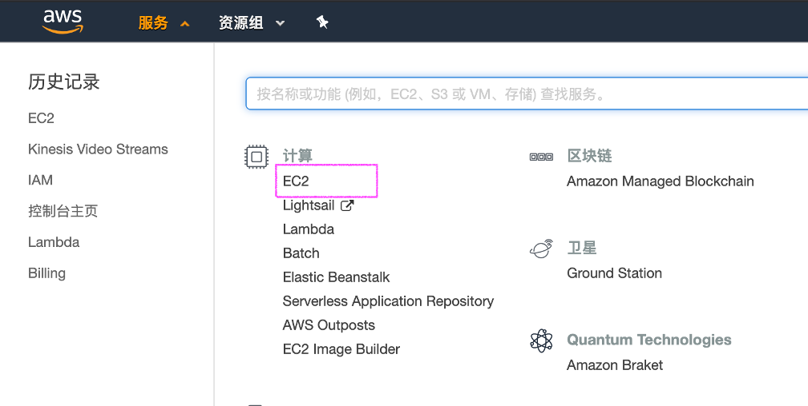

网络选择默认VPC，自动分配共有IP选择“禁用”， 点击“审核和启动”，点击“启动”。
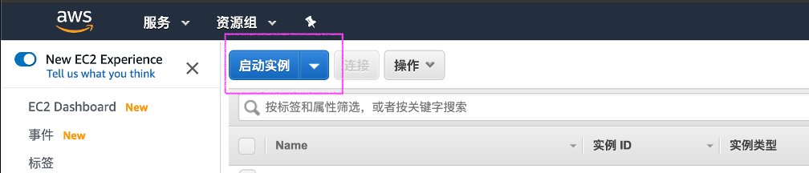

创建新增密钥对，密钥对名称“sgp-kvs-demo”, 下载密钥对后，启动实例；等待5分钟等待实例初始化完成。

选择弹性IP，点击“分配弹性IP地址”
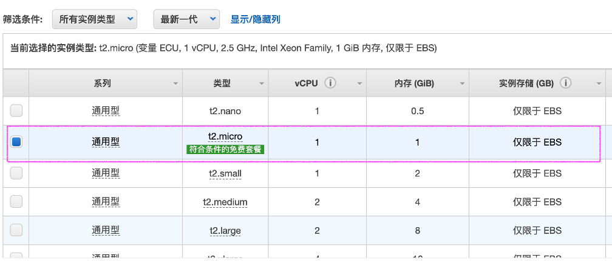
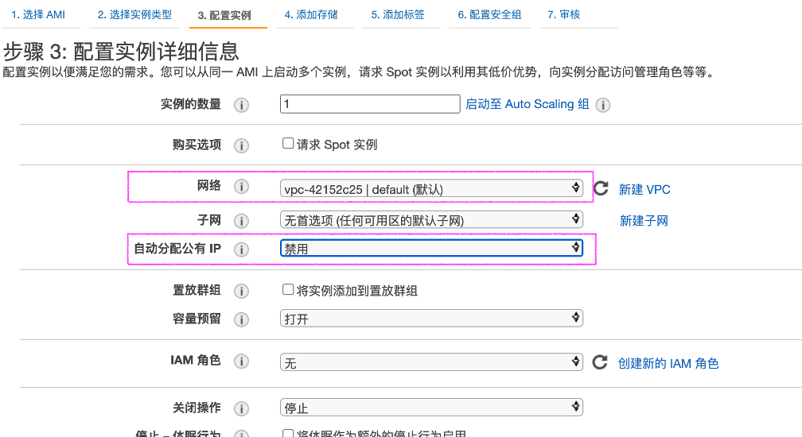
下载密钥对用于ssh登录
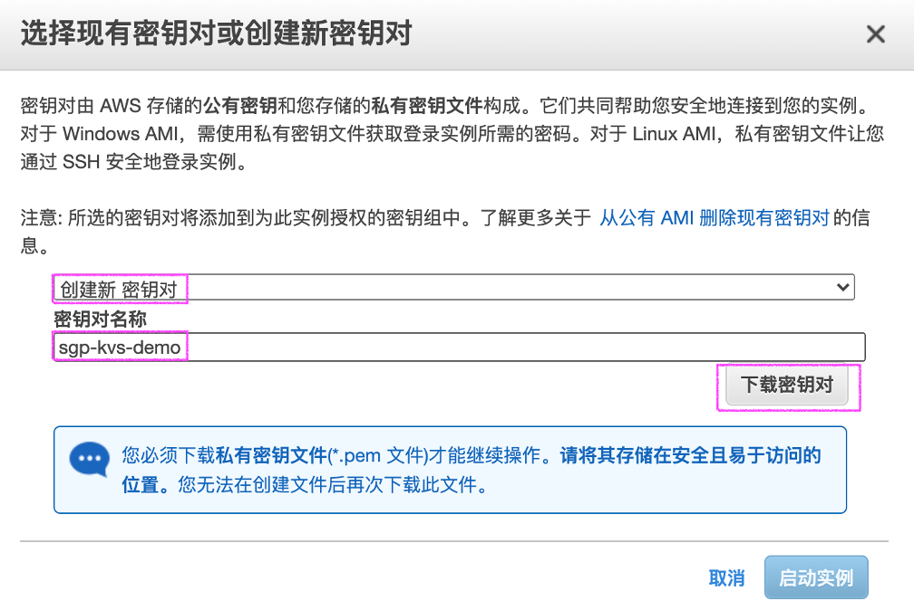
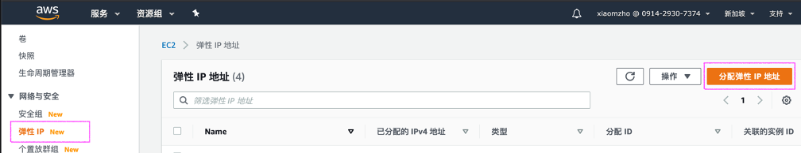
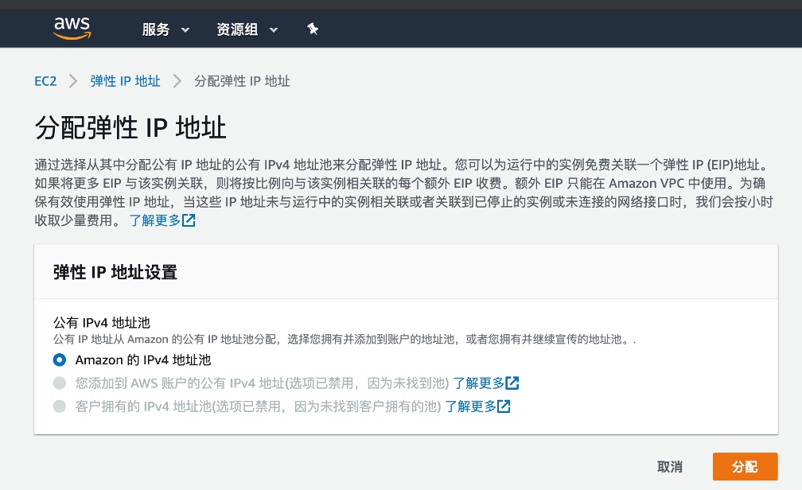
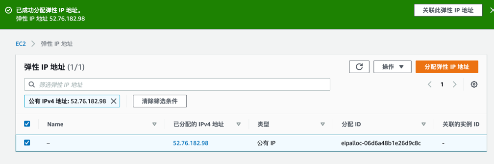
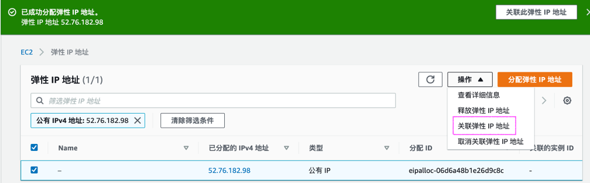
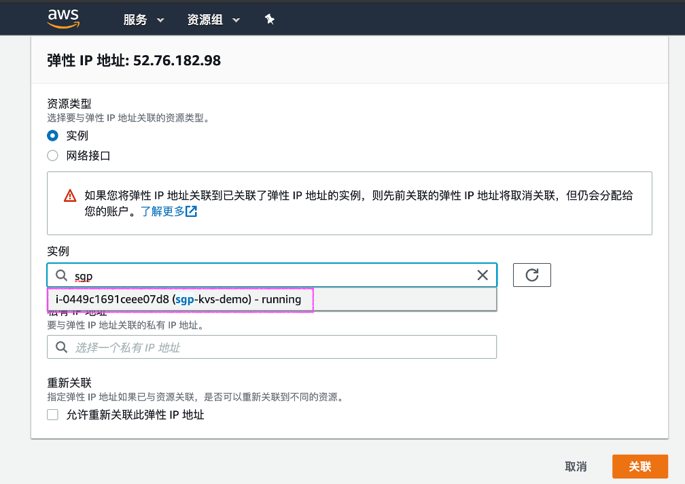
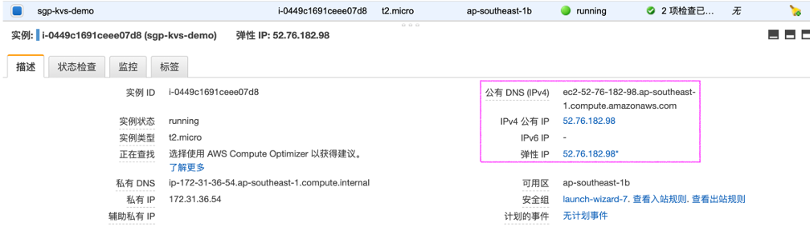

