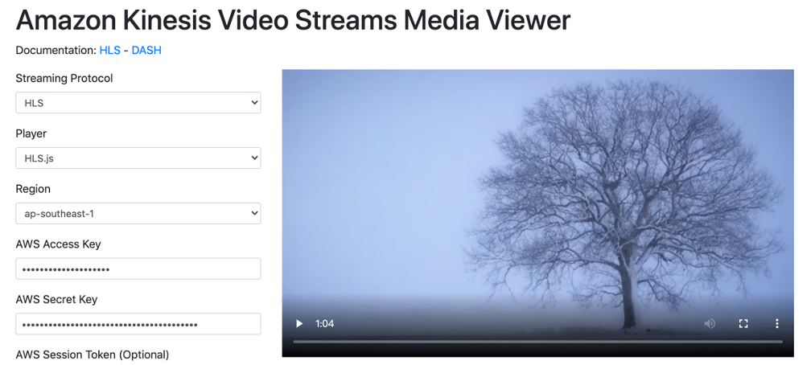

## Lab4:播放演示

git clone --recursive https://github.com/aws-samples/amazon-kinesis-video-streams-media-viewer.git

或

https://github.com/aws-samples/amazon-kinesis-video-streams-media-viewer 选择Download Zip 本地解压

打开 <本地下载路径>/amazon-kinesis-video-streams-media-viewer/index.html
```
Streaming Protocol              选择HLS
Player                          选择HLS.js
Region                          选择 ap-southeast-1
AWS Access Key                  <填入Excel表格中access key>
AWS Secret Key                  <填入Excel表格中secret key>
Stream name                     MyStream
Playback Mode                   选择LIVE_RELAY
Start Timestamp                 <推流开始时间>
End Timestamp                   <推流结束时间>
Fragment Selector Type          选择PRODUCTER_TIMESTAMP
Container Format                选择FARGMENTED_MP4
Discontinuity Mode              选择ALWAYS
Display Fragment Timestamp      选择NEVER
Display Fragment Number         选择NEVER
```
点击 **Start Playback**最终效果如下：


